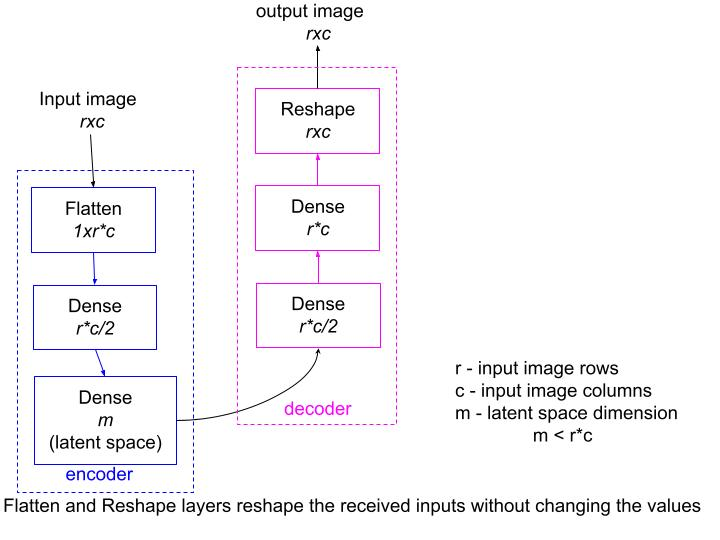
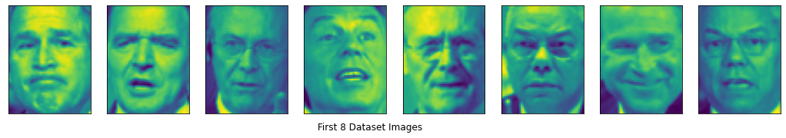
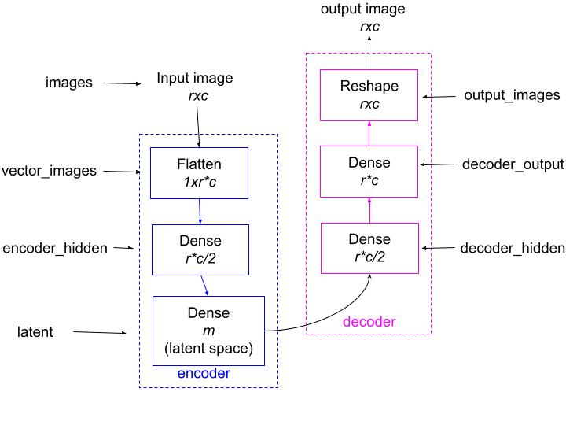
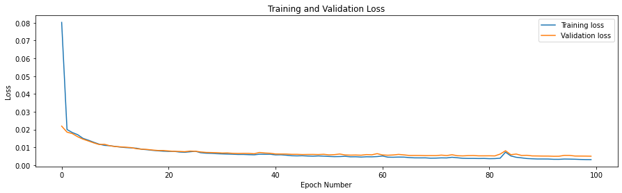
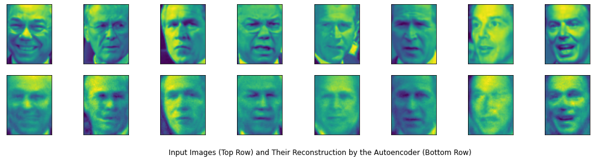
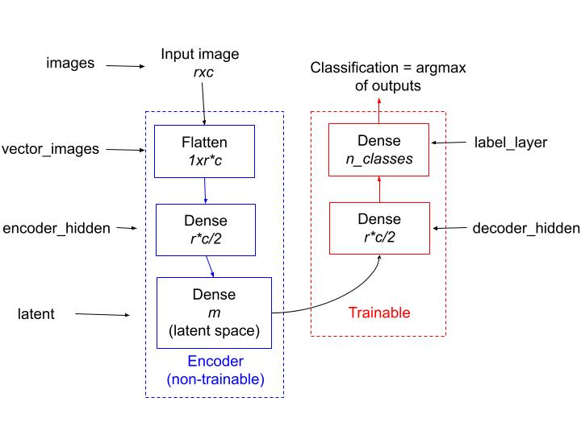
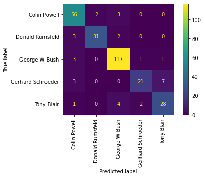

# How to Build an Autoencoder Using Keras and TensorFlow

**Subtitle**: How to build an autoencoder for image compression, image reconstruction and supervised learning using the TensorFlow library

**Summary**: You can easily build an autoencoder using objects and APIs from the Keras and TensorFlow library. Here are the basics of what you need to know to build your own autoencoder.

**Byline**: Mehreen Saeed 

An autoencoder has two parts: an encoder and a decoder. The encoder learns a latent representation of the input data and the decoder is trained to reconstruct the original inputs from the latent representations. The autoencoder has the following applications.

- An autoencoder approximates the original input points from the latent representations. This makes it useful for data recovery from corrupt inputs. 
- As the autoencoder learns a latent representation of the input data, it can be designed so that the dimensions of this latent space is much smaller than the original input dimensions. Hence, an autoencoder can be used for data compression.
- Autoencoders find their application for data augmentation. The outputs from the autoencoder represent synthetic data and hence, can be added to the original training set to increase its size.
- The latent representation from an autoencoder can be used to learn classification and regression tasks.

In this article we'll work with a faces dataset to build a simple autoencoder. We'll use it for reconstructing the original face images. We'll also visualize the latent space and build a supervised classifier from it that performs face recognition. For the implementation part, we'll use TensorFlow and Keras library to build our model. 

It is important to note that the output shown in this article will not match the output that you get at your end. It will vary with each run of the program because of the stochastic nature of the algorithms involved. 

## A Conceptual Diagram of the Autoencoder

The figure below shows a conceptual diagram of the autoencoder we are about to build. The encoder is shown in blue and the decoder is shown in pink. The input to the encoder is an `rxc` face image. The encoder uses the `Flatten` layer to vectorize the image to an `r*c` dimensional vector. The flatten layer passes the input to a `Dense` layer with half as many units as the original image pixels. The final layer of the encoder is the `Dense` layer with `m` units, where `m` is much smaller than the number of input image pixels. This is the latent representation of the input.

Figure 1 shows the decoder part of the autoencoder in blue. The decoder reverses all the steps of the encoder. The output from the layer representing the latent space is passed to a `Dense` layer with half as many units as the pixels in the original image. The output from this layer is passed to a `Dense` layer with the number of units same as the pixels of the original image. This layer effectively creates a vectorized representation of the output image, which in turn is passed to the `Reshape` layer that reshapes the image vector back to an `rxc` image.

[Figure 1](https://drive.google.com/file/d/1FNGjuT_phJje8wRRDFM0pkDfFxWdXGtZ/view?usp=sharing)


<p align = "center"> <b>Figure 1:</b> The Autoencoder Model</p>

## The Import Section
Before starting the implementation, import the following libraries/modules in your code. 


```python
from tensorflow.keras import Sequential
from tensorflow.keras.models import Model
from tensorflow.keras.layers import Input, Dense
from tensorflow.keras.layers import Reshape, Flatten
# For dataset
from sklearn.datasets import fetch_lfw_people
from sklearn.model_selection import train_test_split
# For miscellaneous functions
from tensorflow.keras import utils
# For array functions
import numpy as np
# For plotting
import matplotlib.pyplot as plt
# For confusion matrix
from sklearn.metrics import confusion_matrix, ConfusionMatrixDisplay
```

## Load the Labeled Faces in the Wild (LFW) People Dataset 

The `scikit-learn` library includes the labeled faces in the wild (LFW) dataset, which consists of gray scale face images of different people. As the dataset is imbalanced, we'll load only the face images whose total images per person is 100 or more. We'll also rescale each image to half its dimensions to make it more manageable. 

Let's load the dataset and display a few images along with some data statistics.


```python
# Read the data
lfw_people = fetch_lfw_people(min_faces_per_person=100, resize=0.5)
# Get statistics of data
n_samples, r, c = lfw_people.images.shape
target_names = lfw_people.target_names
n_classes = target_names.shape[0]

# Display first 8 images of dataset
total_cols = 8
fig, ax = plt.subplots(nrows=1, ncols=total_cols,
                      figsize=(18,4),
                      subplot_kw=dict(xticks=[], yticks=[]))

for j in range(total_cols):
    ax[j].imshow(lfw_people.images[j, :, :])
plt.title('First 8 Dataset Images', y=-0.2, x=-4)    
plt.show()    

# Print statistics
print('STATISTICS')
print('Dataset has ', n_samples, 'sample images')
print('Each image is ', r, 'x', c)
print('Faces are of:\n', target_names)

```





    STATISTICS
    Dataset has  1140 sample images
    Each image is  62 x 47
    Faces are of:
     ['Colin Powell' 'Donald Rumsfeld' 'George W Bush' 'Gerhard Schroeder'
     'Tony Blair']


### Prepare the Train and Test Data

The next step is to prepare the train and test data. The following steps are implemented in the code below:

1. Use `train_test_split()` method to split the dataset into a 75% training and 25% test set. 
1. Normalize each image's pixel values to lie between 0 and 1. As the grayscale images have pixel values between 0 and 255, we can divide each pixel value by 255 to normalize the entire image.
1. Use the `to_categorical()` method to convert each target value (range [0, 5]) to a 5 dimensional binary categorical vector.
1. Print the training and test data statistics


```python
X = lfw_people.images
y = lfw_people.target
# Create train and test sets
train_X, test_X, train_Y, test_Y = train_test_split(
                        X, y, test_size=0.25, random_state=0
                        )
# Normalize each image
train_X = train_X/255
test_X = test_X/255
# Create 5 dimensional binary indicator vectors
train_Y_categorical = utils.to_categorical(train_Y)
test_Y_categorical = utils.to_categorical(test_Y)
# Print statistics
print("Training data shape: ", train_X.shape)
print("Training categorical labels shape: ", train_Y_categorical.shape)
print("Test data shape: ", test_X.shape)
print("Test categorical labels shape: ", test_Y_categorical.shape)
```

    Training data shape:  (855, 62, 47)
    Training categorical labels shape:  (855, 5)
    Test data shape:  (285, 62, 47)
    Test categorical labels shape:  (285, 5)


## Create the Autoencoder Model

The code below shows how you can use the `Flatten`, `Dense` and `Reshape` layers to create an autoencoder model shown in Figure 2. The value of the `latent_dimension` is set at 420. You can experiment with different values of this variable. 

As we want the input images to match exactly the output images, we optimize with respect to the mean square error (`mse`). This can be specified as a parameter to the `compile()` method.

[Figure 2](https://drive.google.com/file/d/11EKDpUBamsHPSBuxAfeEUvDmQv8IXxfB/view?usp=sharing)


<p align = "center"> <b>Figure 2:</b> The Autoencoder Model With Layer Names Used in the Code</p>


```python
latent_dimension = 420
input_shape = (train_X.shape[1], train_X.shape[2])
n_inputs = input_shape[0]*input_shape[1]
images = Input(shape=(input_shape[0], input_shape[1], ))
vector_images = Flatten()(images)
# encoder 
encoder_hidden = Dense(n_inputs/2, activation='relu')(vector_images)
latent = Dense(latent_dimension, activation='relu')(encoder_hidden)
# define decoder
decoder_hidden = Dense(n_inputs/2, activation='relu')(latent)
# output dense layer
decoder_output = Dense(n_inputs, activation='linear')(decoder_hidden)
output_images = Reshape((input_shape[0], input_shape[1], ))(decoder_output)
# define autoencoder model
autoencoder = Model(inputs=images, outputs=output_images)
# compile autoencoder model
autoencoder.compile(optimizer='adam', loss='mse')
```

Let's look at the summary of the autoencoder model we just built


```python
autoencoder.summary()
```

    Model: "model"
    _________________________________________________________________
    Layer (type)                 Output Shape              Param #   
    =================================================================
    input_1 (InputLayer)         [(None, 62, 47)]          0         
    _________________________________________________________________
    flatten (Flatten)            (None, 2914)              0         
    _________________________________________________________________
    dense (Dense)                (None, 1457)              4247155   
    _________________________________________________________________
    dense_1 (Dense)              (None, 420)               612360    
    _________________________________________________________________
    dense_2 (Dense)              (None, 1457)              613397    
    _________________________________________________________________
    dense_3 (Dense)              (None, 2914)              4248612   
    _________________________________________________________________
    reshape (Reshape)            (None, 62, 47)            0         
    =================================================================
    Total params: 9,721,524
    Trainable params: 9,721,524
    Non-trainable params: 0
    _________________________________________________________________


## Training the Autoencoder

Now we are ready to train the autoencoder model we just built. The `fit()` method below trains the model and returns a `history` object with details of the entire training process.


```python
# fit the autoencoder model to reconstruct input
history = autoencoder.fit(train_X, train_X, epochs=100, validation_split=0.33)
```

    Epoch 1/100
    18/18 [==============================] - 1s 51ms/step - loss: 0.0802 - val_loss: 0.0219
    Epoch 2/100
    18/18 [==============================] - 1s 68ms/step - loss: 0.0200 - val_loss: 0.0185
    Epoch 3/100
    18/18 [==============================] - 1s 59ms/step - loss: 0.0183 - val_loss: 0.0177
    Epoch 4/100
    18/18 [==============================] - 1s 63ms/step - loss: 0.0171 - val_loss: 0.0159
    Epoch 5/100
    18/18 [==============================] - 1s 61ms/step - loss: 0.0150 - val_loss: 0.0146
    Epoch 6/100
    18/18 [==============================] - 1s 55ms/step - loss: 0.0140 - val_loss: 0.0135
    Epoch 7/100
    18/18 [==============================] - 1s 66ms/step - loss: 0.0128 - val_loss: 0.0125
    Epoch 8/100
    18/18 [==============================] - 1s 45ms/step - loss: 0.0118 - val_loss: 0.0116
    Epoch 9/100
    18/18 [==============================] - 1s 50ms/step - loss: 0.0111 - val_loss: 0.0117
    Epoch 10/100
    18/18 [==============================] - 1s 50ms/step - loss: 0.0109 - val_loss: 0.0109
    Epoch 11/100
    18/18 [==============================] - 1s 61ms/step - loss: 0.0105 - val_loss: 0.0104
    Epoch 12/100
    18/18 [==============================] - 1s 46ms/step - loss: 0.0101 - val_loss: 0.0102
    Epoch 13/100
    18/18 [==============================] - 1s 47ms/step - loss: 0.0098 - val_loss: 0.0100
    Epoch 14/100
    18/18 [==============================] - 1s 45ms/step - loss: 0.0097 - val_loss: 0.0098
    Epoch 15/100
    18/18 [==============================] - 1s 44ms/step - loss: 0.0095 - val_loss: 0.0092
    Epoch 16/100
    18/18 [==============================] - 1s 44ms/step - loss: 0.0089 - val_loss: 0.0089
    Epoch 17/100
    18/18 [==============================] - 1s 47ms/step - loss: 0.0086 - val_loss: 0.0088
    Epoch 18/100
    18/18 [==============================] - 1s 62ms/step - loss: 0.0083 - val_loss: 0.0084
    Epoch 19/100
    18/18 [==============================] - 1s 51ms/step - loss: 0.0080 - val_loss: 0.0082
    Epoch 20/100
    18/18 [==============================] - 1s 45ms/step - loss: 0.0078 - val_loss: 0.0082
    Epoch 21/100
    18/18 [==============================] - 1s 47ms/step - loss: 0.0077 - val_loss: 0.0079
    Epoch 22/100
    18/18 [==============================] - 1s 46ms/step - loss: 0.0077 - val_loss: 0.0077
    Epoch 23/100
    18/18 [==============================] - 1s 49ms/step - loss: 0.0073 - val_loss: 0.0077
    Epoch 24/100
    18/18 [==============================] - 1s 48ms/step - loss: 0.0072 - val_loss: 0.0075
    Epoch 25/100
    18/18 [==============================] - 1s 47ms/step - loss: 0.0075 - val_loss: 0.0079
    Epoch 26/100
    18/18 [==============================] - 1s 51ms/step - loss: 0.0078 - val_loss: 0.0078
    Epoch 27/100
    18/18 [==============================] - 1s 58ms/step - loss: 0.0070 - val_loss: 0.0074
    Epoch 28/100
    18/18 [==============================] - 1s 53ms/step - loss: 0.0067 - val_loss: 0.0071
    Epoch 29/100
    18/18 [==============================] - 1s 54ms/step - loss: 0.0066 - val_loss: 0.0071
    Epoch 30/100
    18/18 [==============================] - 1s 48ms/step - loss: 0.0064 - val_loss: 0.0070
    Epoch 31/100
    18/18 [==============================] - 1s 55ms/step - loss: 0.0063 - val_loss: 0.0068
    Epoch 32/100
    18/18 [==============================] - 1s 54ms/step - loss: 0.0062 - val_loss: 0.0068
    Epoch 33/100
    18/18 [==============================] - 1s 52ms/step - loss: 0.0061 - val_loss: 0.0066
    Epoch 34/100
    18/18 [==============================] - 1s 59ms/step - loss: 0.0060 - val_loss: 0.0065
    Epoch 35/100
    18/18 [==============================] - 1s 56ms/step - loss: 0.0060 - val_loss: 0.0066
    Epoch 36/100
    18/18 [==============================] - 1s 56ms/step - loss: 0.0059 - val_loss: 0.0066
    Epoch 37/100
    18/18 [==============================] - 1s 49ms/step - loss: 0.0058 - val_loss: 0.0064
    Epoch 38/100
    18/18 [==============================] - 1s 52ms/step - loss: 0.0061 - val_loss: 0.0071
    Epoch 39/100
    18/18 [==============================] - 1s 46ms/step - loss: 0.0061 - val_loss: 0.0068
    Epoch 40/100
    18/18 [==============================] - 1s 47ms/step - loss: 0.0061 - val_loss: 0.0066
    Epoch 41/100
    18/18 [==============================] - 1s 54ms/step - loss: 0.0057 - val_loss: 0.0063
    Epoch 42/100
    18/18 [==============================] - 1s 49ms/step - loss: 0.0058 - val_loss: 0.0062
    Epoch 43/100
    18/18 [==============================] - 1s 48ms/step - loss: 0.0056 - val_loss: 0.0062
    Epoch 44/100
    18/18 [==============================] - 1s 49ms/step - loss: 0.0052 - val_loss: 0.0060
    Epoch 45/100
    18/18 [==============================] - 1s 50ms/step - loss: 0.0052 - val_loss: 0.0060
    Epoch 46/100
    18/18 [==============================] - 1s 51ms/step - loss: 0.0052 - val_loss: 0.0059
    Epoch 47/100
    18/18 [==============================] - 1s 63ms/step - loss: 0.0051 - val_loss: 0.0060
    Epoch 48/100
    18/18 [==============================] - 1s 50ms/step - loss: 0.0050 - val_loss: 0.0060
    Epoch 49/100
    18/18 [==============================] - 1s 50ms/step - loss: 0.0051 - val_loss: 0.0059
    Epoch 50/100
    18/18 [==============================] - 1s 51ms/step - loss: 0.0050 - val_loss: 0.0061
    Epoch 51/100
    18/18 [==============================] - 1s 66ms/step - loss: 0.0049 - val_loss: 0.0057
    Epoch 52/100
    18/18 [==============================] - 1s 61ms/step - loss: 0.0047 - val_loss: 0.0059
    Epoch 53/100
    18/18 [==============================] - 1s 59ms/step - loss: 0.0048 - val_loss: 0.0062
    Epoch 54/100
    18/18 [==============================] - 1s 65ms/step - loss: 0.0049 - val_loss: 0.0057
    Epoch 55/100
    18/18 [==============================] - 1s 58ms/step - loss: 0.0046 - val_loss: 0.0056
    Epoch 56/100
    18/18 [==============================] - 1s 63ms/step - loss: 0.0047 - val_loss: 0.0057
    Epoch 57/100
    18/18 [==============================] - 1s 51ms/step - loss: 0.0045 - val_loss: 0.0056
    Epoch 58/100
    18/18 [==============================] - 1s 61ms/step - loss: 0.0047 - val_loss: 0.0059
    Epoch 59/100
    18/18 [==============================] - 1s 57ms/step - loss: 0.0046 - val_loss: 0.0058
    Epoch 60/100
    18/18 [==============================] - 1s 48ms/step - loss: 0.0048 - val_loss: 0.0064
    Epoch 61/100
    18/18 [==============================] - 1s 64ms/step - loss: 0.0051 - val_loss: 0.0057
    Epoch 62/100
    18/18 [==============================] - 1s 64ms/step - loss: 0.0044 - val_loss: 0.0056
    Epoch 63/100
    18/18 [==============================] - 1s 48ms/step - loss: 0.0044 - val_loss: 0.0057
    Epoch 64/100
    18/18 [==============================] - 1s 43ms/step - loss: 0.0045 - val_loss: 0.0060
    Epoch 65/100
    18/18 [==============================] - 1s 44ms/step - loss: 0.0045 - val_loss: 0.0057
    Epoch 66/100
    18/18 [==============================] - 1s 45ms/step - loss: 0.0042 - val_loss: 0.0054
    Epoch 67/100
    18/18 [==============================] - 1s 48ms/step - loss: 0.0041 - val_loss: 0.0054
    Epoch 68/100
    18/18 [==============================] - 1s 44ms/step - loss: 0.0041 - val_loss: 0.0054
    Epoch 69/100
    18/18 [==============================] - 1s 44ms/step - loss: 0.0041 - val_loss: 0.0053
    Epoch 70/100
    18/18 [==============================] - 1s 45ms/step - loss: 0.0039 - val_loss: 0.0053
    Epoch 71/100
    18/18 [==============================] - 1s 44ms/step - loss: 0.0039 - val_loss: 0.0053
    Epoch 72/100
    18/18 [==============================] - 1s 44ms/step - loss: 0.0041 - val_loss: 0.0056
    Epoch 73/100
    18/18 [==============================] - 1s 44ms/step - loss: 0.0040 - val_loss: 0.0054
    Epoch 74/100
    18/18 [==============================] - 1s 44ms/step - loss: 0.0044 - val_loss: 0.0058
    Epoch 75/100
    18/18 [==============================] - 1s 45ms/step - loss: 0.0041 - val_loss: 0.0053
    Epoch 76/100
    18/18 [==============================] - 1s 44ms/step - loss: 0.0038 - val_loss: 0.0052
    Epoch 77/100
    18/18 [==============================] - 1s 44ms/step - loss: 0.0037 - val_loss: 0.0053
    Epoch 78/100
    18/18 [==============================] - 1s 44ms/step - loss: 0.0037 - val_loss: 0.0054
    Epoch 79/100
    18/18 [==============================] - 1s 46ms/step - loss: 0.0037 - val_loss: 0.0052
    Epoch 80/100
    18/18 [==============================] - 1s 47ms/step - loss: 0.0037 - val_loss: 0.0052
    Epoch 81/100
    18/18 [==============================] - 1s 66ms/step - loss: 0.0036 - val_loss: 0.0052
    Epoch 82/100
    18/18 [==============================] - 1s 50ms/step - loss: 0.0036 - val_loss: 0.0052
    Epoch 83/100
    18/18 [==============================] - 1s 56ms/step - loss: 0.0039 - val_loss: 0.0062
    Epoch 84/100
    18/18 [==============================] - 1s 53ms/step - loss: 0.0073 - val_loss: 0.0081
    Epoch 85/100
    18/18 [==============================] - 1s 53ms/step - loss: 0.0052 - val_loss: 0.0059
    Epoch 86/100
    18/18 [==============================] - 1s 54ms/step - loss: 0.0044 - val_loss: 0.0062
    Epoch 87/100
    18/18 [==============================] - 1s 65ms/step - loss: 0.0041 - val_loss: 0.0054
    Epoch 88/100
    18/18 [==============================] - 1s 63ms/step - loss: 0.0037 - val_loss: 0.0055
    Epoch 89/100
    18/18 [==============================] - 1s 61ms/step - loss: 0.0035 - val_loss: 0.0052
    Epoch 90/100
    18/18 [==============================] - 1s 45ms/step - loss: 0.0034 - val_loss: 0.0051
    Epoch 91/100
    18/18 [==============================] - 1s 49ms/step - loss: 0.0034 - val_loss: 0.0051
    Epoch 92/100
    18/18 [==============================] - 1s 48ms/step - loss: 0.0034 - val_loss: 0.0051
    Epoch 93/100
    18/18 [==============================] - 1s 49ms/step - loss: 0.0032 - val_loss: 0.0049
    Epoch 94/100
    18/18 [==============================] - 1s 47ms/step - loss: 0.0032 - val_loss: 0.0050
    Epoch 95/100
    18/18 [==============================] - 1s 43ms/step - loss: 0.0034 - val_loss: 0.0055
    Epoch 96/100
    18/18 [==============================] - 1s 44ms/step - loss: 0.0034 - val_loss: 0.0054
    Epoch 97/100
    18/18 [==============================] - 1s 43ms/step - loss: 0.0033 - val_loss: 0.0051
    Epoch 98/100
    18/18 [==============================] - 1s 43ms/step - loss: 0.0032 - val_loss: 0.0051
    Epoch 99/100
    18/18 [==============================] - 1s 43ms/step - loss: 0.0031 - val_loss: 0.0050
    Epoch 100/100
    18/18 [==============================] - 1s 43ms/step - loss: 0.0031 - val_loss: 0.0050


We can visualize the entire learning process by using the values stored in the dictionary object of `history`. The following code prints the keys of the `history.history` dictionary object and plots the training and validation loss for each epoch. As expected, the value of the loss function for the training set is lower than the loss value for the validation set. 


```python
print('Keys of history.history: ', history.history.keys())

fig = plt.figure(figsize=(15,4))
plt.plot(history.history['loss'])
plt.plot(history.history['val_loss'])
plt.legend(['Training loss', 'Validation loss'])
plt.title('Training and Validation Loss')
plt.xlabel('Epoch Number')
plt.ylabel('Loss')
plt.show()
```

    Keys of history.history:  dict_keys(['loss', 'val_loss'])





## Reconstructing the Input Images
After training the autoencoder, we can look at what the reconstructed input images look like. The `predict()` method returns the output of the autoencoder for the inputs specified as a parameter. The code below displays the first 8 images of the test set in the first row and their corresponding reconstructions in the second row.


```python
# Reconstruction
reconstructed_test = autoencoder.predict(test_X)
# Display the inputs and reconstructions
total_cols = 8
fig, ax = plt.subplots(nrows=2, ncols=total_cols,
                      figsize=(18,4),
                      subplot_kw=dict(xticks=[], yticks=[]))

for j in range(total_cols):
    ax[0, j].imshow(test_X[j, :, :])
    ax[1, j].imshow(reconstructed_test[j, :, :])
plt.title('Input Images (Top Row) and Their Reconstruction by the Autoencoder (Bottom Row)', y=-0.4, x=-5)    
plt.show()    
```





The reconstructed images are quite interesting. We can see that they are an approximation of the original images and closely replicate the facial expression of the input face. This makes them useful for augmenting a limited training set with more examples. You can generate as many images as needed by training the autoencoder multiple times. The reconstructed faces will vary with each run as the weights of the autoencoder are intialized randomly.

## Dissecting the Encoder

Tensorflow allows you to access the different layers of a model. We can easily retrieve the encoder block of the autoencoder by using the `Model()` method and instantiating it with the input `images` and output `latent` layer that we created earlier. Let's look at the summary of the encoder model.


```python
# Encoder model
encoder_model = Model(inputs=images, outputs=latent)
encoder_model.summary()
```

    Model: "model_1"
    _________________________________________________________________
    Layer (type)                 Output Shape              Param #   
    =================================================================
    input_1 (InputLayer)         [(None, 62, 47)]          0         
    _________________________________________________________________
    flatten (Flatten)            (None, 2914)              0         
    _________________________________________________________________
    dense (Dense)                (None, 1457)              4247155   
    _________________________________________________________________
    dense_1 (Dense)              (None, 420)               612360    
    =================================================================
    Total params: 4,859,515
    Trainable params: 4,859,515
    Non-trainable params: 0
    _________________________________________________________________


The summary shows that we started out with an input of `62*47=2914` pixels and reduced it to only `420` outputs. These 420 outputs are an internal/latent space representation of the corresponding input image. The output of the encoder is hard for us to interpret. However, we can give it a try and visualize it by displaying it as an image. The code below arbitrarily reshapes the latent representation to a 20x21 image and renders it. The top row shows the input training image and the bottom row shows the corresponding latent representation.


```python
# Encoder output
encoder_output = encoder_model.predict(train_X)

latent_dim = encoder_output.shape[1]
latent_shape = (20,21)
# Plot the first 8 images and their corresponding latent representation
total_cols = 8
fig, ax = plt.subplots(nrows=2, ncols=total_cols,
                      figsize=(18,4),
                      subplot_kw=dict(xticks=[], yticks=[]))

for j in range(total_cols):
    train_image = train_X[j, :, :]
    ax[0, j].imshow(train_image)
    encoder_image = np.reshape(encoder_output[j, :], latent_shape)
    ax[1, j].imshow(encoder_image)
plt.title('Input Images (Top Row) and Their Encoder Latent Representation (Bottom Row)', y=-0.4, x=-4)    
plt.show()    
```


## Using the Autoencoder for Supervised Learning
Strictly speaking, an autoencoder is not a supervised learning model as it is trained with unlabeled images. However, we can use its latent representation to train a supervised learning model. The code below instantiates a `classifier` model by using all the layers of the autoencoder starting with the `vector_images` layer up to the `decoder_hidden` layer. It then appends the model with a `softmax` layer containing as many units as the number of classes/categories present in our dataset. 

In the `classifier` model, we'll set all the encoder layers to be non-trainable. This way the input image will be converted to its learned latent representation to be further processed by the classifier. The classifier will start training with the decoder weights tuned by the autoencoder and fine tune them further to learn the classification of each latent representation. Figure 3 shows a block diagram of the classifier created from the autoencoder model. Now that we have a multiclass classification problem, we can use the 'categorical_crossentropy' as our loss function when compiling the model.

[Figure 3](https://drive.google.com/file/d/1o5JTVUCjG4mY8g-RpWR31SOoKpVX3Za0/view?usp=sharing)

<p align = "center"> <b>Figure 3:</b> The Classifier Model Created From the Encoder </p>


```python
# Create classifier model
classifier = Sequential()
label_layer = Dense(n_classes, activation='softmax')(decoder_hidden)
classifier = Model(inputs=images, outputs=label_layer)

# Set the encoder layers to non-trainable
for layer in classifier.layers[:-2]:
    layer.trainable=False

# Compile the model    
classifier.compile(optimizer='adam', loss='categorical_crossentropy', metrics=['accuracy'])
```

Here is the summary of the classifier model. You can see that it has 620,687 trainable parameters associated with the last two layers. The rest of the weights uptil the encoder layer are non-trainable.


```python
classifier.summary()
```

    Model: "model_2"
    _________________________________________________________________
    Layer (type)                 Output Shape              Param #   
    =================================================================
    input_1 (InputLayer)         [(None, 62, 47)]          0         
    _________________________________________________________________
    flatten (Flatten)            (None, 2914)              0         
    _________________________________________________________________
    dense (Dense)                (None, 1457)              4247155   
    _________________________________________________________________
    dense_1 (Dense)              (None, 420)               612360    
    _________________________________________________________________
    dense_2 (Dense)              (None, 1457)              613397    
    _________________________________________________________________
    dense_4 (Dense)              (None, 5)                 7290      
    =================================================================
    Total params: 5,480,202
    Trainable params: 620,687
    Non-trainable params: 4,859,515
    _________________________________________________________________


Let's train the classifier using the `fit()` method.


```python
history = classifier.fit(train_X, train_Y_categorical, epochs=150, validation_split=0.33)
```

    Epoch 1/150
    18/18 [==============================] - 1s 30ms/step - loss: 1.3415 - accuracy: 0.4668 - val_loss: 1.1846 - val_accuracy: 0.5300
    Epoch 2/150
    18/18 [==============================] - 0s 11ms/step - loss: 1.1362 - accuracy: 0.5559 - val_loss: 1.0383 - val_accuracy: 0.6113
    Epoch 3/150
    18/18 [==============================] - 0s 12ms/step - loss: 0.9913 - accuracy: 0.6084 - val_loss: 0.9970 - val_accuracy: 0.6784
    Epoch 4/150
    18/18 [==============================] - 0s 12ms/step - loss: 0.8902 - accuracy: 0.7028 - val_loss: 0.9639 - val_accuracy: 0.6396
    Epoch 5/150
    18/18 [==============================] - 0s 12ms/step - loss: 0.8480 - accuracy: 0.7063 - val_loss: 0.8832 - val_accuracy: 0.7527
    Epoch 6/150
    18/18 [==============================] - 0s 11ms/step - loss: 0.7661 - accuracy: 0.7535 - val_loss: 0.8163 - val_accuracy: 0.7208
    Epoch 7/150
    18/18 [==============================] - 0s 12ms/step - loss: 0.7111 - accuracy: 0.7465 - val_loss: 0.7681 - val_accuracy: 0.7951
    Epoch 8/150
    18/18 [==============================] - 0s 11ms/step - loss: 0.6626 - accuracy: 0.7780 - val_loss: 0.7232 - val_accuracy: 0.7562
    Epoch 9/150
    18/18 [==============================] - 0s 11ms/step - loss: 0.6129 - accuracy: 0.7885 - val_loss: 0.7323 - val_accuracy: 0.7845
    Epoch 10/150
    18/18 [==============================] - 0s 12ms/step - loss: 0.5917 - accuracy: 0.7937 - val_loss: 0.6797 - val_accuracy: 0.7845
    Epoch 11/150
    18/18 [==============================] - 0s 11ms/step - loss: 0.5697 - accuracy: 0.8112 - val_loss: 0.6842 - val_accuracy: 0.7703
    Epoch 12/150
    18/18 [==============================] - 0s 12ms/step - loss: 0.5490 - accuracy: 0.8042 - val_loss: 0.7066 - val_accuracy: 0.7774
    Epoch 13/150
    18/18 [==============================] - 0s 12ms/step - loss: 0.5941 - accuracy: 0.7850 - val_loss: 0.7625 - val_accuracy: 0.7527
    Epoch 14/150
    18/18 [==============================] - 0s 11ms/step - loss: 0.5665 - accuracy: 0.7937 - val_loss: 0.7185 - val_accuracy: 0.7314
    Epoch 15/150
    18/18 [==============================] - 0s 11ms/step - loss: 0.5309 - accuracy: 0.8042 - val_loss: 0.6852 - val_accuracy: 0.7668
    Epoch 16/150
    18/18 [==============================] - 0s 12ms/step - loss: 0.5029 - accuracy: 0.8322 - val_loss: 0.6677 - val_accuracy: 0.7809
    Epoch 17/150
    18/18 [==============================] - 0s 11ms/step - loss: 0.4597 - accuracy: 0.8497 - val_loss: 0.6813 - val_accuracy: 0.7633
    Epoch 18/150
    18/18 [==============================] - 0s 12ms/step - loss: 0.4676 - accuracy: 0.8601 - val_loss: 0.6150 - val_accuracy: 0.7951
    Epoch 19/150
    18/18 [==============================] - 0s 15ms/step - loss: 0.4680 - accuracy: 0.8497 - val_loss: 0.6408 - val_accuracy: 0.7703
    Epoch 20/150
    18/18 [==============================] - 0s 17ms/step - loss: 0.4339 - accuracy: 0.8549 - val_loss: 0.6130 - val_accuracy: 0.7845
    Epoch 21/150
    18/18 [==============================] - 0s 18ms/step - loss: 0.4307 - accuracy: 0.8531 - val_loss: 0.6045 - val_accuracy: 0.8057
    Epoch 22/150
    18/18 [==============================] - 0s 14ms/step - loss: 0.3925 - accuracy: 0.8671 - val_loss: 0.6153 - val_accuracy: 0.7845
    Epoch 23/150
    18/18 [==============================] - 0s 16ms/step - loss: 0.4086 - accuracy: 0.8706 - val_loss: 0.6553 - val_accuracy: 0.7739
    Epoch 24/150
    18/18 [==============================] - 0s 15ms/step - loss: 0.4040 - accuracy: 0.8654 - val_loss: 0.6054 - val_accuracy: 0.7915
    Epoch 25/150
    18/18 [==============================] - ETA: 0s - loss: 0.4044 - accuracy: 0.85 - 0s 15ms/step - loss: 0.4031 - accuracy: 0.8584 - val_loss: 0.6595 - val_accuracy: 0.7774
    Epoch 26/150
    18/18 [==============================] - 0s 18ms/step - loss: 0.3891 - accuracy: 0.8671 - val_loss: 0.6369 - val_accuracy: 0.7951
    Epoch 27/150
    18/18 [==============================] - 0s 17ms/step - loss: 0.3536 - accuracy: 0.8829 - val_loss: 0.6125 - val_accuracy: 0.7986
    Epoch 28/150
    18/18 [==============================] - 0s 16ms/step - loss: 0.3546 - accuracy: 0.8846 - val_loss: 0.6212 - val_accuracy: 0.7845
    Epoch 29/150
    18/18 [==============================] - 0s 13ms/step - loss: 0.3199 - accuracy: 0.9108 - val_loss: 0.5877 - val_accuracy: 0.7951
    Epoch 30/150
    18/18 [==============================] - 0s 18ms/step - loss: 0.3133 - accuracy: 0.9091 - val_loss: 0.6154 - val_accuracy: 0.7915
    Epoch 31/150
    18/18 [==============================] - 0s 17ms/step - loss: 0.3142 - accuracy: 0.9108 - val_loss: 0.6053 - val_accuracy: 0.7986
    Epoch 32/150
    18/18 [==============================] - 0s 17ms/step - loss: 0.3113 - accuracy: 0.9038 - val_loss: 0.5887 - val_accuracy: 0.7951
    Epoch 33/150
    18/18 [==============================] - 0s 16ms/step - loss: 0.3053 - accuracy: 0.8916 - val_loss: 0.6290 - val_accuracy: 0.7774
    Epoch 34/150
    18/18 [==============================] - 0s 14ms/step - loss: 0.2998 - accuracy: 0.9073 - val_loss: 0.6020 - val_accuracy: 0.7915
    Epoch 35/150
    18/18 [==============================] - 0s 15ms/step - loss: 0.2903 - accuracy: 0.9143 - val_loss: 0.5801 - val_accuracy: 0.8021
    Epoch 36/150
    18/18 [==============================] - 0s 14ms/step - loss: 0.2822 - accuracy: 0.9213 - val_loss: 0.6050 - val_accuracy: 0.7951
    Epoch 37/150
    18/18 [==============================] - 0s 17ms/step - loss: 0.2764 - accuracy: 0.9143 - val_loss: 0.6281 - val_accuracy: 0.7915
    Epoch 38/150
    18/18 [==============================] - 0s 18ms/step - loss: 0.2556 - accuracy: 0.9318 - val_loss: 0.6221 - val_accuracy: 0.7845
    Epoch 39/150
    18/18 [==============================] - 0s 16ms/step - loss: 0.2434 - accuracy: 0.9371 - val_loss: 0.5905 - val_accuracy: 0.8092
    Epoch 40/150
    18/18 [==============================] - 0s 12ms/step - loss: 0.2368 - accuracy: 0.9353 - val_loss: 0.6157 - val_accuracy: 0.7986
    Epoch 41/150
    18/18 [==============================] - 0s 12ms/step - loss: 0.2372 - accuracy: 0.9458 - val_loss: 0.6252 - val_accuracy: 0.7915
    Epoch 42/150
    18/18 [==============================] - 0s 12ms/step - loss: 0.2371 - accuracy: 0.9301 - val_loss: 0.6239 - val_accuracy: 0.7951
    Epoch 43/150
    18/18 [==============================] - 0s 12ms/step - loss: 0.2274 - accuracy: 0.9371 - val_loss: 0.6276 - val_accuracy: 0.7845
    Epoch 44/150
    18/18 [==============================] - 0s 12ms/step - loss: 0.2258 - accuracy: 0.9301 - val_loss: 0.6315 - val_accuracy: 0.7809
    Epoch 45/150
    18/18 [==============================] - 0s 12ms/step - loss: 0.2083 - accuracy: 0.9441 - val_loss: 0.6092 - val_accuracy: 0.7951
    Epoch 46/150
    18/18 [==============================] - 0s 16ms/step - loss: 0.1965 - accuracy: 0.9423 - val_loss: 0.5982 - val_accuracy: 0.7845
    Epoch 47/150
    18/18 [==============================] - 0s 13ms/step - loss: 0.1786 - accuracy: 0.9668 - val_loss: 0.5803 - val_accuracy: 0.8057
    Epoch 48/150
    18/18 [==============================] - 0s 19ms/step - loss: 0.1765 - accuracy: 0.9598 - val_loss: 0.5763 - val_accuracy: 0.7951
    Epoch 49/150
    18/18 [==============================] - 0s 16ms/step - loss: 0.1790 - accuracy: 0.9650 - val_loss: 0.6312 - val_accuracy: 0.7845
    Epoch 50/150
    18/18 [==============================] - 0s 25ms/step - loss: 0.1630 - accuracy: 0.9668 - val_loss: 0.5877 - val_accuracy: 0.7986
    Epoch 51/150
    18/18 [==============================] - 0s 22ms/step - loss: 0.1582 - accuracy: 0.9650 - val_loss: 0.6562 - val_accuracy: 0.8021
    Epoch 52/150
    18/18 [==============================] - 0s 17ms/step - loss: 0.1960 - accuracy: 0.9458 - val_loss: 0.6311 - val_accuracy: 0.7915
    Epoch 53/150
    18/18 [==============================] - 0s 22ms/step - loss: 0.1870 - accuracy: 0.9528 - val_loss: 0.6353 - val_accuracy: 0.7915
    Epoch 54/150
    18/18 [==============================] - 0s 22ms/step - loss: 0.1585 - accuracy: 0.9545 - val_loss: 0.6331 - val_accuracy: 0.8057
    Epoch 55/150
    18/18 [==============================] - 0s 28ms/step - loss: 0.1566 - accuracy: 0.9598 - val_loss: 0.6269 - val_accuracy: 0.7880
    Epoch 56/150
    18/18 [==============================] - 0s 18ms/step - loss: 0.1367 - accuracy: 0.9755 - val_loss: 0.6320 - val_accuracy: 0.7915
    Epoch 57/150
    18/18 [==============================] - 0s 21ms/step - loss: 0.1270 - accuracy: 0.9668 - val_loss: 0.6208 - val_accuracy: 0.7915
    Epoch 58/150
    18/18 [==============================] - 1s 32ms/step - loss: 0.1194 - accuracy: 0.9825 - val_loss: 0.5925 - val_accuracy: 0.8021
    Epoch 59/150
    18/18 [==============================] - 0s 22ms/step - loss: 0.1149 - accuracy: 0.9808 - val_loss: 0.6095 - val_accuracy: 0.8057
    Epoch 60/150
    18/18 [==============================] - 0s 19ms/step - loss: 0.1117 - accuracy: 0.9878 - val_loss: 0.6126 - val_accuracy: 0.8021
    Epoch 61/150
    18/18 [==============================] - 1s 30ms/step - loss: 0.1120 - accuracy: 0.9860 - val_loss: 0.6204 - val_accuracy: 0.8057
    Epoch 62/150
    18/18 [==============================] - 0s 15ms/step - loss: 0.1166 - accuracy: 0.9703 - val_loss: 0.6634 - val_accuracy: 0.7986
    Epoch 63/150
    18/18 [==============================] - 0s 12ms/step - loss: 0.1152 - accuracy: 0.9808 - val_loss: 0.6342 - val_accuracy: 0.8057
    Epoch 64/150
    18/18 [==============================] - 0s 13ms/step - loss: 0.1066 - accuracy: 0.9860 - val_loss: 0.6182 - val_accuracy: 0.7986
    Epoch 65/150
    18/18 [==============================] - 0s 15ms/step - loss: 0.0934 - accuracy: 0.9930 - val_loss: 0.6247 - val_accuracy: 0.7986
    Epoch 66/150
    18/18 [==============================] - 0s 12ms/step - loss: 0.1053 - accuracy: 0.9860 - val_loss: 0.6225 - val_accuracy: 0.7915
    Epoch 67/150
    18/18 [==============================] - 0s 12ms/step - loss: 0.0935 - accuracy: 0.9895 - val_loss: 0.6071 - val_accuracy: 0.7951
    Epoch 68/150
    18/18 [==============================] - 0s 12ms/step - loss: 0.0910 - accuracy: 0.9895 - val_loss: 0.6553 - val_accuracy: 0.7845
    Epoch 69/150
    18/18 [==============================] - 0s 12ms/step - loss: 0.0901 - accuracy: 0.9895 - val_loss: 0.6119 - val_accuracy: 0.7915
    Epoch 70/150
    18/18 [==============================] - 0s 12ms/step - loss: 0.0864 - accuracy: 0.9895 - val_loss: 0.6193 - val_accuracy: 0.7951
    Epoch 71/150
    18/18 [==============================] - 0s 17ms/step - loss: 0.0764 - accuracy: 0.9930 - val_loss: 0.6345 - val_accuracy: 0.7951
    Epoch 72/150
    18/18 [==============================] - 0s 12ms/step - loss: 0.0750 - accuracy: 0.9948 - val_loss: 0.6181 - val_accuracy: 0.7880
    Epoch 73/150
    18/18 [==============================] - 0s 12ms/step - loss: 0.0722 - accuracy: 0.9948 - val_loss: 0.6422 - val_accuracy: 0.7951
    Epoch 74/150
    18/18 [==============================] - 0s 13ms/step - loss: 0.0713 - accuracy: 0.9948 - val_loss: 0.6852 - val_accuracy: 0.7880
    Epoch 75/150
    18/18 [==============================] - 0s 17ms/step - loss: 0.0745 - accuracy: 0.9948 - val_loss: 0.6666 - val_accuracy: 0.7880
    Epoch 76/150
    18/18 [==============================] - 0s 17ms/step - loss: 0.0679 - accuracy: 0.9948 - val_loss: 0.6589 - val_accuracy: 0.7951
    Epoch 77/150
    18/18 [==============================] - 0s 15ms/step - loss: 0.0636 - accuracy: 0.9965 - val_loss: 0.6475 - val_accuracy: 0.7951
    Epoch 78/150
    18/18 [==============================] - 0s 11ms/step - loss: 0.0652 - accuracy: 0.9948 - val_loss: 0.6215 - val_accuracy: 0.8092
    Epoch 79/150
    18/18 [==============================] - 0s 13ms/step - loss: 0.0620 - accuracy: 0.9983 - val_loss: 0.6714 - val_accuracy: 0.8092
    Epoch 80/150
    18/18 [==============================] - 0s 12ms/step - loss: 0.0537 - accuracy: 0.9983 - val_loss: 0.6436 - val_accuracy: 0.7986
    Epoch 81/150
    18/18 [==============================] - 0s 11ms/step - loss: 0.0570 - accuracy: 0.9965 - val_loss: 0.6352 - val_accuracy: 0.7951
    Epoch 82/150
    18/18 [==============================] - 0s 12ms/step - loss: 0.0543 - accuracy: 0.9965 - val_loss: 0.6296 - val_accuracy: 0.8092
    Epoch 83/150
    18/18 [==============================] - 0s 11ms/step - loss: 0.0498 - accuracy: 0.9965 - val_loss: 0.6477 - val_accuracy: 0.7986
    Epoch 84/150
    18/18 [==============================] - 0s 12ms/step - loss: 0.0484 - accuracy: 0.9948 - val_loss: 0.6589 - val_accuracy: 0.8021
    Epoch 85/150
    18/18 [==============================] - 0s 11ms/step - loss: 0.0477 - accuracy: 0.9983 - val_loss: 0.6661 - val_accuracy: 0.7986
    Epoch 86/150
    18/18 [==============================] - 0s 11ms/step - loss: 0.0448 - accuracy: 0.9983 - val_loss: 0.6666 - val_accuracy: 0.7986
    Epoch 87/150
    18/18 [==============================] - 0s 11ms/step - loss: 0.0448 - accuracy: 0.9983 - val_loss: 0.6597 - val_accuracy: 0.8021
    Epoch 88/150
    18/18 [==============================] - 0s 11ms/step - loss: 0.0457 - accuracy: 0.9948 - val_loss: 0.6620 - val_accuracy: 0.7986
    Epoch 89/150
    18/18 [==============================] - 0s 12ms/step - loss: 0.0419 - accuracy: 0.9983 - val_loss: 0.7318 - val_accuracy: 0.8057
    Epoch 90/150
    18/18 [==============================] - 0s 14ms/step - loss: 0.0459 - accuracy: 0.9983 - val_loss: 0.6710 - val_accuracy: 0.8057
    Epoch 91/150
    18/18 [==============================] - 0s 12ms/step - loss: 0.0385 - accuracy: 0.9983 - val_loss: 0.6850 - val_accuracy: 0.7986
    Epoch 92/150
    18/18 [==============================] - 0s 17ms/step - loss: 0.0384 - accuracy: 0.9983 - val_loss: 0.6703 - val_accuracy: 0.7951
    Epoch 93/150
    18/18 [==============================] - 0s 17ms/step - loss: 0.0391 - accuracy: 0.9983 - val_loss: 0.6986 - val_accuracy: 0.8057
    Epoch 94/150
    18/18 [==============================] - 0s 14ms/step - loss: 0.0355 - accuracy: 1.0000 - val_loss: 0.6915 - val_accuracy: 0.7915
    Epoch 95/150
    18/18 [==============================] - 0s 16ms/step - loss: 0.0344 - accuracy: 0.9983 - val_loss: 0.6990 - val_accuracy: 0.7986
    Epoch 96/150
    18/18 [==============================] - 0s 17ms/step - loss: 0.0310 - accuracy: 1.0000 - val_loss: 0.6654 - val_accuracy: 0.8057
    Epoch 97/150
    18/18 [==============================] - 0s 16ms/step - loss: 0.0304 - accuracy: 0.9983 - val_loss: 0.6736 - val_accuracy: 0.7809
    Epoch 98/150
    18/18 [==============================] - 0s 17ms/step - loss: 0.0309 - accuracy: 0.9983 - val_loss: 0.6604 - val_accuracy: 0.7951
    Epoch 99/150
    18/18 [==============================] - 0s 14ms/step - loss: 0.0296 - accuracy: 0.9983 - val_loss: 0.6957 - val_accuracy: 0.8021
    Epoch 100/150
    18/18 [==============================] - 0s 12ms/step - loss: 0.0307 - accuracy: 1.0000 - val_loss: 0.6931 - val_accuracy: 0.7951
    Epoch 101/150
    18/18 [==============================] - 0s 12ms/step - loss: 0.0281 - accuracy: 1.0000 - val_loss: 0.7180 - val_accuracy: 0.7880
    Epoch 102/150
    18/18 [==============================] - 0s 12ms/step - loss: 0.0284 - accuracy: 1.0000 - val_loss: 0.6979 - val_accuracy: 0.7915
    Epoch 103/150
    18/18 [==============================] - 0s 13ms/step - loss: 0.0275 - accuracy: 1.0000 - val_loss: 0.6991 - val_accuracy: 0.7915
    Epoch 104/150
    18/18 [==============================] - 0s 11ms/step - loss: 0.0277 - accuracy: 0.9983 - val_loss: 0.7136 - val_accuracy: 0.7915
    Epoch 105/150
    18/18 [==============================] - 0s 11ms/step - loss: 0.0288 - accuracy: 0.9983 - val_loss: 0.6782 - val_accuracy: 0.7845
    Epoch 106/150
    18/18 [==============================] - 0s 11ms/step - loss: 0.0260 - accuracy: 1.0000 - val_loss: 0.7152 - val_accuracy: 0.8057
    Epoch 107/150
    18/18 [==============================] - 0s 13ms/step - loss: 0.0243 - accuracy: 1.0000 - val_loss: 0.7470 - val_accuracy: 0.8127
    Epoch 108/150
    18/18 [==============================] - 0s 12ms/step - loss: 0.0312 - accuracy: 0.9965 - val_loss: 0.7144 - val_accuracy: 0.7845
    Epoch 109/150
    18/18 [==============================] - 0s 12ms/step - loss: 0.0325 - accuracy: 1.0000 - val_loss: 0.7240 - val_accuracy: 0.7845
    Epoch 110/150
    18/18 [==============================] - 0s 12ms/step - loss: 0.0227 - accuracy: 1.0000 - val_loss: 0.7068 - val_accuracy: 0.7951
    Epoch 111/150
    18/18 [==============================] - 0s 13ms/step - loss: 0.0214 - accuracy: 0.9983 - val_loss: 0.7036 - val_accuracy: 0.7915
    Epoch 112/150
    18/18 [==============================] - 0s 12ms/step - loss: 0.0198 - accuracy: 1.0000 - val_loss: 0.7492 - val_accuracy: 0.8021
    Epoch 113/150
    18/18 [==============================] - 0s 12ms/step - loss: 0.0209 - accuracy: 1.0000 - val_loss: 0.7284 - val_accuracy: 0.8021
    Epoch 114/150
    18/18 [==============================] - 0s 12ms/step - loss: 0.0184 - accuracy: 1.0000 - val_loss: 0.7409 - val_accuracy: 0.7986
    Epoch 115/150
    18/18 [==============================] - 0s 12ms/step - loss: 0.0185 - accuracy: 1.0000 - val_loss: 0.7206 - val_accuracy: 0.7951
    Epoch 116/150
    18/18 [==============================] - 0s 14ms/step - loss: 0.0177 - accuracy: 1.0000 - val_loss: 0.7156 - val_accuracy: 0.7880
    Epoch 117/150
    18/18 [==============================] - 0s 16ms/step - loss: 0.0175 - accuracy: 1.0000 - val_loss: 0.7230 - val_accuracy: 0.7915
    Epoch 118/150
    18/18 [==============================] - 0s 16ms/step - loss: 0.0172 - accuracy: 1.0000 - val_loss: 0.7235 - val_accuracy: 0.7915
    Epoch 119/150
    18/18 [==============================] - 0s 23ms/step - loss: 0.0161 - accuracy: 1.0000 - val_loss: 0.7176 - val_accuracy: 0.7915
    Epoch 120/150
    18/18 [==============================] - 0s 16ms/step - loss: 0.0151 - accuracy: 1.0000 - val_loss: 0.7472 - val_accuracy: 0.7986
    Epoch 121/150
    18/18 [==============================] - 0s 17ms/step - loss: 0.0156 - accuracy: 1.0000 - val_loss: 0.7197 - val_accuracy: 0.7951
    Epoch 122/150
    18/18 [==============================] - 0s 17ms/step - loss: 0.0143 - accuracy: 1.0000 - val_loss: 0.7318 - val_accuracy: 0.7915
    Epoch 123/150
    18/18 [==============================] - 0s 17ms/step - loss: 0.0155 - accuracy: 1.0000 - val_loss: 0.7439 - val_accuracy: 0.8057
    Epoch 124/150
    18/18 [==============================] - 0s 14ms/step - loss: 0.0147 - accuracy: 1.0000 - val_loss: 0.7311 - val_accuracy: 0.7951
    Epoch 125/150
    18/18 [==============================] - 0s 19ms/step - loss: 0.0134 - accuracy: 1.0000 - val_loss: 0.7557 - val_accuracy: 0.8057
    Epoch 126/150
    18/18 [==============================] - 0s 20ms/step - loss: 0.0135 - accuracy: 1.0000 - val_loss: 0.7220 - val_accuracy: 0.7915
    Epoch 127/150
    18/18 [==============================] - 0s 15ms/step - loss: 0.0134 - accuracy: 1.0000 - val_loss: 0.7433 - val_accuracy: 0.7880
    Epoch 128/150
    18/18 [==============================] - 0s 14ms/step - loss: 0.0136 - accuracy: 1.0000 - val_loss: 0.7418 - val_accuracy: 0.7986
    Epoch 129/150
    18/18 [==============================] - 0s 20ms/step - loss: 0.0141 - accuracy: 1.0000 - val_loss: 0.7423 - val_accuracy: 0.8021
    Epoch 130/150
    18/18 [==============================] - 0s 19ms/step - loss: 0.0128 - accuracy: 1.0000 - val_loss: 0.7491 - val_accuracy: 0.7951
    Epoch 131/150
    18/18 [==============================] - 0s 22ms/step - loss: 0.0124 - accuracy: 1.0000 - val_loss: 0.7467 - val_accuracy: 0.8021
    Epoch 132/150
    18/18 [==============================] - 0s 22ms/step - loss: 0.0116 - accuracy: 1.0000 - val_loss: 0.7470 - val_accuracy: 0.7986
    Epoch 133/150
    18/18 [==============================] - 0s 18ms/step - loss: 0.0120 - accuracy: 1.0000 - val_loss: 0.7693 - val_accuracy: 0.7986
    Epoch 134/150
    18/18 [==============================] - 0s 16ms/step - loss: 0.0122 - accuracy: 1.0000 - val_loss: 0.7437 - val_accuracy: 0.7880
    Epoch 135/150
    18/18 [==============================] - 0s 18ms/step - loss: 0.0112 - accuracy: 1.0000 - val_loss: 0.7454 - val_accuracy: 0.7915
    Epoch 136/150
    18/18 [==============================] - 0s 22ms/step - loss: 0.0105 - accuracy: 1.0000 - val_loss: 0.7496 - val_accuracy: 0.7880
    Epoch 137/150
    18/18 [==============================] - 0s 25ms/step - loss: 0.0104 - accuracy: 1.0000 - val_loss: 0.7683 - val_accuracy: 0.8021
    Epoch 138/150
    18/18 [==============================] - 0s 22ms/step - loss: 0.0107 - accuracy: 1.0000 - val_loss: 0.7632 - val_accuracy: 0.7880
    Epoch 139/150
    18/18 [==============================] - 0s 20ms/step - loss: 0.0103 - accuracy: 1.0000 - val_loss: 0.7672 - val_accuracy: 0.7951
    Epoch 140/150
    18/18 [==============================] - 0s 18ms/step - loss: 0.0107 - accuracy: 1.0000 - val_loss: 0.7880 - val_accuracy: 0.8021
    Epoch 141/150
    18/18 [==============================] - 0s 19ms/step - loss: 0.0105 - accuracy: 1.0000 - val_loss: 0.7745 - val_accuracy: 0.8021
    Epoch 142/150
    18/18 [==============================] - 0s 20ms/step - loss: 0.0096 - accuracy: 1.0000 - val_loss: 0.7635 - val_accuracy: 0.7986
    Epoch 143/150
    18/18 [==============================] - 0s 17ms/step - loss: 0.0091 - accuracy: 1.0000 - val_loss: 0.7695 - val_accuracy: 0.7951
    Epoch 144/150
    18/18 [==============================] - 0s 15ms/step - loss: 0.0090 - accuracy: 1.0000 - val_loss: 0.7683 - val_accuracy: 0.7915
    Epoch 145/150
    18/18 [==============================] - 0s 23ms/step - loss: 0.0093 - accuracy: 1.0000 - val_loss: 0.7638 - val_accuracy: 0.7880
    Epoch 146/150
    18/18 [==============================] - 0s 18ms/step - loss: 0.0087 - accuracy: 1.0000 - val_loss: 0.7673 - val_accuracy: 0.7915
    Epoch 147/150
    18/18 [==============================] - 0s 17ms/step - loss: 0.0085 - accuracy: 1.0000 - val_loss: 0.7759 - val_accuracy: 0.7915
    Epoch 148/150
    18/18 [==============================] - 0s 11ms/step - loss: 0.0083 - accuracy: 1.0000 - val_loss: 0.7698 - val_accuracy: 0.7986
    Epoch 149/150
    18/18 [==============================] - 0s 12ms/step - loss: 0.0083 - accuracy: 1.0000 - val_loss: 0.7680 - val_accuracy: 0.7880
    Epoch 150/150
    18/18 [==============================] - 0s 14ms/step - loss: 0.0082 - accuracy: 1.0000 - val_loss: 0.7616 - val_accuracy: 0.7845


### Evaluate the Classifier
The code below prints the classification accuracy on the training and test sets. As this is a multiclass classification problem, it's good to observe the confusion matrix. While Tensorflow's math module provides a routine for computing the confusion matrix, we'll use the method provided by the scikit-learn's library. This library also includes a nice method for displaying the confusion matrix with fancy colors. We can see that we have a reasonably good accuracy on the face classification task without doing any preprocessing, hyper-parameter tuning and model selection.


```python
train_loss, train_acc = classifier.evaluate(train_X,  train_Y_categorical)
test_loss, test_acc = classifier.evaluate(test_X,  test_Y_categorical)
print('Classification accuracy on training set: ', train_acc)
print('Classification accuracy on test set: ', test_acc)
```

    27/27 [==============================] - 0s 6ms/step - loss: 0.2576 - accuracy: 0.9287
    9/9 [==============================] - 0s 7ms/step - loss: 0.5197 - accuracy: 0.8877
    Classification accuracy on training set:  0.9286549687385559
    Classification accuracy on test set:  0.8877192735671997


```python
# Get the classifier outputs
test_predict = classifier.predict(test_X)
# Get the classification labels
test_predict_labels = np.argmax(test_predict, axis=1)
# Create and display the confusion matrix
test_confusion_matrix = confusion_matrix(test_Y, test_predict_labels)
cm = ConfusionMatrixDisplay(confusion_matrix=test_confusion_matrix, 
                       display_labels=target_names)

cm.plot(xticks_rotation="vertical")
print('Correct classification: ', np.sum(np.diagonal(test_confusion_matrix)), '/', test_X.shape[0])

```

    Correct classification:  253 / 285





## The Next Step
We just developed an autoencoder with an ability to create an approximation representation of its inputs. We also used its latent representation to develop a classifier and applied it to a face recognition problem. While this may not be the best example to demonstrate the merits of the autoencoder as a supervised classifier, it should give you a fairly good idea on how to implement an autoencoder model and use its latent space representation for other tasks. Now that you have a basic understanding of the autoencoder model, you can develop its more advanced and improved variants such as the variational autoencoder or the sparse autoencoder.


